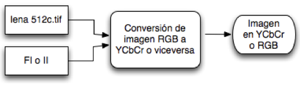
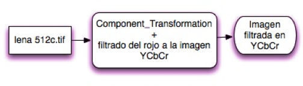
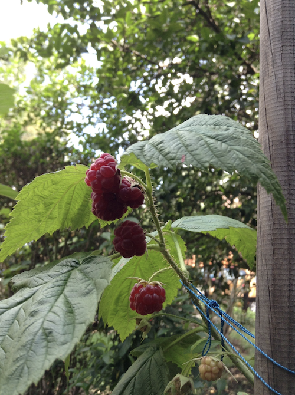
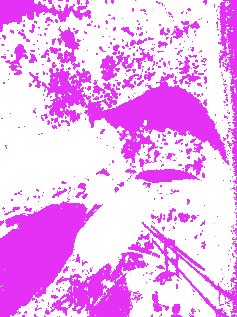

# filtro-RGB-YCbCr
Función que realice un filtrado en los canales YCbCr.

## Objetivo
*Usar la función Componet_Transformation.m para transformar la imagen en los canales YCbCr. Y filtrar el rojo.

*Hacer una función que realice un filtrado en los canales YCbCr  y después mostrar la imagen a RGB.

## Introducción
La primer parte es filtrar el rojo en una matriz en YCbCr, y la segunda parte es ver como para el ojo humano no es perceptible a el filtrado que se hace a la imagen en YCbCr.

	
	

## Procedimiento
Realiza un imread a una imagen en matlab.

Luego se le asigna a una variable y luego utiliza la función Cromatico que usara la función Component Transformation para convertir la imagen a YCbCr y luego permite solo el canal 3 para que la imagen quede así:

Para la segunda parte se usa de nuevo la función Component Transformation y se incluye en una función llamada Filtradow y realiza un nuevo filtro en YCbCr con los parámetros “122”, “144” y “11616” a la imagen:

Como resultado se obtiene la imagen:

En RGB que no es perceptible al filtrado pero en la imagen que se encuentra en YCbCr se puede notar el resultado si se compara con su estado original en YCbCr como en la imagen:

